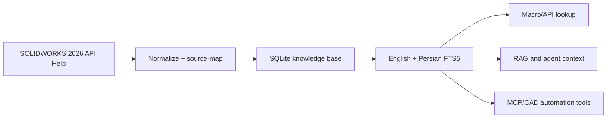

# SOLIDWORKS Drawing API Database 2026

[](https://github.com/Erfouni/solidworks-drawing-api-2026/actions/workflows/ci.yml)
[](https://www.python.org/)
[](https://www.sqlite.org/fts5.html)
[](https://help.solidworks.com/2026/english/api/)
[](LICENSE)

This is a normalized, source-traceable SQLite knowledge base for drawing creation
and automation with SOLIDWORKS macros, scripts, COM add-ins, and Document Manager.

It turns thousands of scattered API symbols, examples, enumerations, and guide
topics into one offline database that can support precise macro lookup, RAG
retrieval, MCP tools, engineering assistants, and reproducible automation research.

- Database: [`exports/solidworks_drawing_api_2026.sqlite`](exports/solidworks_drawing_api_2026.sqlite)
- SHA-256: `f20e73e5e90f5fcd331fb33ead74fbdbdea10152f49fc39dc3135e64de47f2e5`
- Validation: `True` (`PRAGMA integrity_check = ok`)

[Download the SQLite database](exports/solidworks_drawing_api_2026.sqlite) ·
[View the machine-readable manifest](exports/solidworks_drawing_api_2026_manifest.json)

## Quick start

Python's standard-library SQLite driver is enough for searching the delivered
database:

```powershell
python scripts/query_solidworks_drawing_api_db.py "section view"
python scripts/query_solidworks_drawing_api_db.py "نمای برش"
python scripts/query_solidworks_drawing_api_db.py --symbol IDrawingDoc::CreateSectionViewAt5
python scripts/query_solidworks_drawing_api_db.py --workflow create-section-view
python scripts/query_solidworks_drawing_api_db.py --coverage
```

Free text is read as an [FTS5 query](https://www.sqlite.org/fts5.html#full_text_query_syntax),
so `Create*`, `OR` and `title:section` work. Text that is not valid FTS5 syntax,
such as `IDrawingDoc::CreateSectionViewAt5`, `section-view` or `C#`, is searched
for literally instead, with a note on stderr; stdout stays JSON.

The query CLI opens the delivered artifact in SQLite read-only mode. It never
creates or modifies a database while searching.

## From official sources to usable engineering context



Source-backed entities retain an `official_url`; purely synthetic search aliases
may intentionally have no URL. The database is designed to help a tool find the
right primary source—not to replace the official documentation.

## Contents

- 192 API types/interfaces/event delegates
- 2,405 methods/properties with VBA/.NET/C# signatures, parameters, returns, remarks, selection/unit notes, availability, and obsolete replacements
- 2,808 normalized parameters
- 432 relevant enumerations and the full command-ID enumeration
- 7,688 enumeration/command values
- 1,293 official relevant examples indexed by objective, preconditions, postconditions, API calls, language, and exact source URL
- 149 official Programming Guide topics
- 32 task workflows with 129 ordered steps
- 4,554 full-text search documents (English and Persian aliases/tags)

The database stores compact structured facts and original workflow synthesis, not a
verbatim offline mirror. Open `official_url` for the complete official page/example.

## Release quality gates

The checked-in database is tested as a release artifact on Python 3.10, 3.12,
and 3.13. CI verifies:

- the SQLite file SHA-256 and byte size match the manifest;
- `PRAGMA integrity_check` and foreign-key checks pass;
- expected API/workflow record counts are present;
- exact symbol lookup returns a source-traceable result;
- Persian full-text search works;
- the CLI renders bilingual help correctly and cannot create a missing database.

Run the same checks locally:

```powershell
python -m unittest discover -s tests -v
python -m compileall -q scripts tests
```

## Quick search

```sql
SELECT entity_kind, title, snippet(search_fts, 3, '[', ']', ' … ', 24) AS hit, source_url
FROM search_fts
WHERE search_fts MATCH '"section view"'
ORDER BY rank
LIMIT 20;
```

Persian aliases are indexed too:

```sql
SELECT entity_kind, title, snippet(search_fts, 3, '[', ']', ' … ', 24) AS hit
FROM search_fts
WHERE search_fts MATCH '"نمای برش" OR section'
ORDER BY rank
LIMIT 20;
```

Find the recommended workflow first, then resolve its exact calls:

```sql
SELECT * FROM v_workflow_api_map WHERE slug='create-section-view';

SELECT * FROM v_api_member_details
WHERE api_type='IDrawingDoc' AND api_member='CreateSectionViewAt5';
```

Find non-obsolete methods for a task:

```sql
SELECT api_type, api_member, summary, signature_vba, selection_requirements,
       unit_notes, availability, official_url
FROM v_api_member_details
WHERE is_obsolete=0 AND drawing_tasks LIKE '%views%'
ORDER BY api_type, api_member;
```

## Important scope rules

- Every member of drawing-specific interfaces is included.
- Broad interfaces such as `ISldWorks`, `IModelDoc2`, and `IModelDocExtension` are
  limited to members needed by drawing workflows.
- Every enum referenced by those members is included, plus drawing-keyword enums
  and all `swCommands_e` values.
- Full official example source is accessed through its `official_url`; the database
  keeps searchable behavior, requirements, effects, and API-call inventories.
- API geometry/placement values are often SI (meters/radians). Always use the exact
  member parameter descriptions and `unit_notes`.

## Rebuilding

`scripts/build_solidworks_drawing_api_db.py` is the reproducible builder used for
this artifact. It requires Python 3, `lxml`, a licensed local SOLIDWORKS 2026 help
installation, and extracted copies of the official CHM sources under `work/`:
`sa` (`sldworksapi`), `svb` (`sldworksapivb6`), `sc` (`swconst`), `spg`
(`sldworksapiprogguide`), `scmd` (`swcommands`), and `sdm` (`swdocmgrapi`). The
extracted source files are intentionally excluded from this repository. The builder
maps every included record back to its official `help.solidworks.com` URL.

## Provenance and disclaimer

This is an independent, unofficial search index. It is not affiliated with or
endorsed by Dassault Systèmes. SOLIDWORKS is a trademark of Dassault Systèmes or
its subsidiaries. The repository does not redistribute the original CHM files or
a verbatim documentation mirror; it stores normalized facts, compact summaries,
search metadata, and source links. Consult the linked official documentation and
your SOLIDWORKS license terms for authoritative usage requirements.

The MIT license applies to this repository's original source code. See [LICENSE](LICENSE)
for the data and third-party-material boundary. Contributions are welcome through
[CONTRIBUTING.md](CONTRIBUTING.md); report security issues according to
[SECURITY.md](SECURITY.md).
